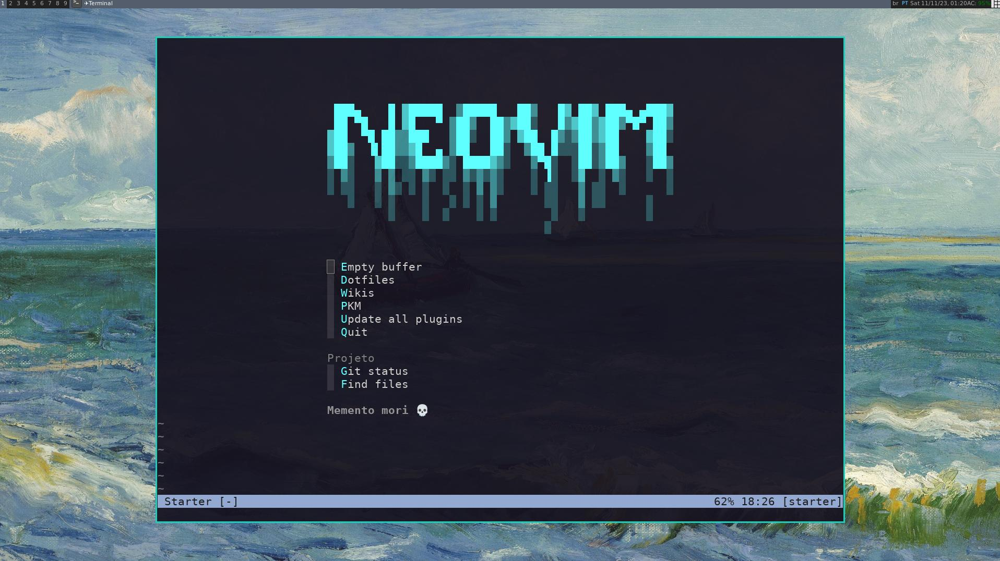
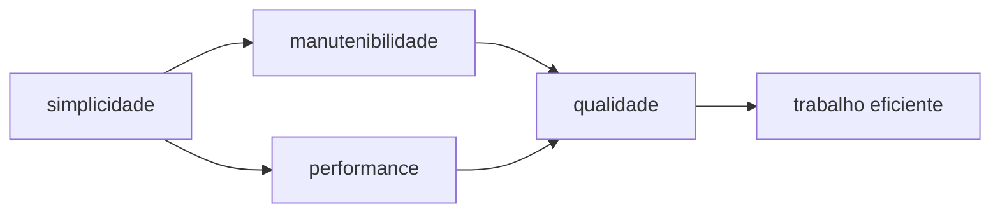

# [dotfiles](http://d.neni.dev)

[](http://neni.dev/emojicom)



Versionamento dos meus arquivos de configuração, scripts, instruções e templates usados no Windows e/ou Linux.

- Nvim
- VSCode
- AwesomeWM
- Bash
- Git

## Simplicidade como preceito



## Utilização

1. Download e link dos arquivos

```bash
cd ~
mkdir -p dev
cd dev
git clone git@github.com:nenitf/dotfiles.git
cd dotfiles
./install.sh
```

2. Configuração de ambiente do nvim

```lua
-- nvim/lua/env.lua
local M = {}

M.clickup = {
  token = "TOKEN",
  user_id = "USER",
  space_id = "SPACE",
  workspace_id = "WORKSPACE",
  filter = {
    statuses = {
      "ready for development",
      "backlog",
      "code review",
      "in development",
    },
  },
}

return M
```

> [Configuração do SSH](https://gist.github.com/nenitf/433e85b49acc802479654c75535eea2c)

<details>
<summary>Baixar Nvim</summary>

```bash
# Ubuntu
curl -LO https://github.com/neovim/neovim/releases/download/nightly/nvim.appimage
chmod u+x nvim.appimage
sudo mv ./nvim.appimage /usr/bin/nvim
```
</details>

<details>
<summary>Suporte ao Vim (sem plugins)</summary>

- Com todos vimscripts
```vim
" ~/.vimrc ou %userprofile%\_vimrc
let g:dotfiles = "~/dev/dotfiles/"
exe "source ".g:dotfiles."nvim/vimrc"
exe "source ".g:dotfiles."nvim/colors/calmo.vim"
```

- O mais simples possível (Windows):
```sh
curl https://raw.githubusercontent.com/nenitf/dotfiles/main/nvim/vimrc > %userprofile%\_vimrc
```

- O mais simples possível (Linux):
```sh
wget https://raw.githubusercontent.com/nenitf/dotfiles/main/nvim/vimrc -O $HOME/.vimrc
```
</details>

## Configurações locais

### Nvim

- `~/.vimrc-pre.vim`: **antes** do carregamento de vários módulos
- `~/.vimrc-local.vim`: **depois** do carregamento completo
- `/path/do/projeto/.exvrc`, `/path/do/projeto/.exrc`, `/path/do/projeto/.nvim.lua` ou `.rgignore` (rg): **depois** do carregamento completo, somente no projeto aberto

### Bash

- `~/.bashrc-local.sh`

<details>
<summary>Exemplo</summary>

```sh
alias cdi='cd ~/dev/i10'
alias cdia='cd ~/dev/i10/api'
alias sailclear='sail artisan optimize:clear'
. "$HOME/.cargo/env"

alias toggl='flatpak run com.toggl.TogglDesktop'
alias outline='sudo ~/bin/Outline-Client.AppImage --no-sandbox'
alias cu='sudo ~/bin/ClickUp-3.0.6.AppImage --no-sandbox'

export GPG_TTY=$(tty)

export XDG_DATA_DIRS='/var/lib/flatpak/exports/share:/home/neni/.local/share/flatpak/exports/share'
```
</details>

### Git

- `~/.gitconfig-local`

<details>
<summary>Exemplo</summary>

```gitconfig
# `~/.gitconfig-local`
[includeIf "gitdir:~/dev/trampo/projetox/"]
    path = dev/trampo/.gitconfig-projetox
```

```gitconfig
# `~/dev/trampo/.gitconfig-projetox`
[include]
    path = .gitconfig-geral-trampo
[core]
    excludesfile = ~/dev/trampo/.gitignore-projetox
```

```gitignore
# `~/dev/trampo/.gitignore-projetox`
meumakefile
up.sh
```

```gitconfig
# `~/dev/trampo/.gitconfig-geral-trampo`
[user]
    name = Felipe Silva
    email = felipe@trampo.com
    username = felipe_silva
[alias]
    s = status
    commit-guide = !cat ~/dev/dotfiles/modelos/git/.gitcommit
    pr = "!f() { git fetch upstream && rebase upstream/$@; }; f"
```
</details>

## Atualização forçada

```bash
git fetch --all
git reset --hard origin/main
```

## Adendos

- [Por que utilizar Vim?](https://wtf.neni.dev/pqvim/)
- [Wiki](https://github.com/nenitf/dotfiles/wiki)
- [My Vimrc](http://vimrc.neni.dev)
